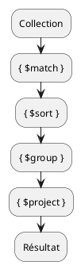

# Agrégation

Le vrai mort que d'agrégation est un système qui permet de constituer une requête étape par étape. Chaque opérateur travaille sur le résultat de l'étape précédente et retourne éventuellement son résultat à l'étape suivante. 

L'ensemble des opérations constituent un pipeline d'agrégation qui part d'une collection et arrive à un résultat transformé.



## Quelques exemples simples

Une seule opération, le compte des documents.
```mongodb
db.persons.aggregate([
    {$count: "nombre de personnes"}
])
```

Nous ajoutons un filtre (`$match`) et comptons le nombre de documents filtrés.
```mongodb
db.persons.aggregate([
    {$match: {gender: 'Femme'}},
    {$count: "nombre de femmes"}
])
```

Regroupement par genre

```mongodb
db.persons.aggregate([
    {
        $group: {
            _id: '$gender',
            nombre: { $sum: 1 }
        }
    }
])
```

Ajout d'une projection qui renomme la clef `_id`

```mongodb
db.persons.aggregate([
    {
        $group: {
            _id: '$gender',
            Nombre: { $sum: 1 }
        }
    },
    {
        $project: {
            'Genre': '$_id',
            _id: 0,
            'Nombre': 1
        }
    }
])
```

### A vous

#### Exercice 1

Afficher la répartition des nationalités dans la base avec un tri par ordre décroissant du nombre de personnes

##### Correction {collapsible="true"}

```mongodb
db.persons.aggregate([
  {
    $group: {
      _id: '$nationality',
      'Nombre de personnes': { $sum: 1 }
    }
  },
  { $sort: { 'Nombre de personnes': -1 } }
])
```

#### Exercice 2

Afficher la somme des salaires annuels par ville de résidence

##### Correction {collapsible="true" id="correction_1"}

```mongodb
db.persons.aggregate([
  {
    $group: {
      _id: "$address.city",
      'total': { $sum: yearlyIncome }
    }
  }
])
```

## Les fonctions de statistiques

| opérateur   | description       |
|-------------|-------------------|
| $sum        | somme             |
| $avg        | moyenne           |
| $count      | compte            |
| $min        | minimum           |
| $max        | maximum           |
| $stdDevPop  | écart type précis |
| $stdDevSamp | écart type estimé |

```mongodb
db.persons.aggregate([
    {
        $group: {
            _id: '$address.country',
            'moyenne des salaires': { '$avg': '$yearlyIncome' },
            'total de salaires': { '$sum': '$yearlyIncome' },
            'max des salaires': { '$max': '$yearlyIncome' },
            'min des salaires': { '$min': '$yearlyIncome' },
            'écart type des salaires': { '$stdDevPop': '$yearlyIncome' },
            'écart type des salaires estimé': { '$stdDevSamp': '$yearlyIncome' },
            'nombre de personnes': { '$sum': 1 }
        }
    }
])
```

> Note : Pour compter dans un regroupement nous devons utiliser `$sum: 1`. L'opérateur `$count` ne sert qu'à compter après un filtre.

```mongodb
db.persons.aggregate([
    {$match: {gender: 'Homme'}},
    {$count: "Nombre d'hommes"}
])

```

## Travailler sur les dates

| Opérateur / Fonction          | Description en Français |
|--------------------------------|-------------------------|
| `new Date()`                   | Crée une nouvelle date avec l'heure actuelle. |
| `ISODate("YYYY-MM-DD")`        | Définit une date au format ISO 8601. |
| `$year`                         | Extrait **l'année** d'un champ de type `Date`. |
| `$month`                        | Extrait **le mois** d'un champ de type `Date`. |
| `$dayOfMonth`                   | Extrait **le jour du mois** d'un champ de type `Date`. |
| `$hour`                         | Extrait **l'heure** d'un champ de type `Date`. |
| `$minute`                       | Extrait **les minutes** d'un champ de type `Date`. |
| `$second`                       | Extrait **les secondes** d'un champ de type `Date`. |
| `$millisecond`                  | Extrait **les millisecondes** d'un champ de type `Date`. |
| `$dayOfWeek`                    | Extrait **le jour de la semaine** (1=Dimanche, 7=Samedi). |
| `$dateToString`                 | Convertit une date en chaîne de caractères avec un format personnalisé. |
| `$add`                          | Ajoute un nombre de millisecondes à une date. |
| `$subtract`                     | Soustrait un nombre de millisecondes à une date. |
| `$dateFromString`               | Convertit une chaîne en un objet `Date`. |
| `$dateToString` avec `timezone` | Convertit une date en texte en **ajustant le fuseau horaire**. |

### Exemples

Extraction de l'année de naissance. Ici l'utilisation de `$dateFromString` est obligatoire car les dates ont été importées comme des chaînes de caractères.

```mongodb
db.persons.aggregate([
    {
        $project: {
            _id: 0,
            lastName: 1,
            'année de naissance': {
                $year: {
                    $dateFromString: {
                        dateString: "$birthDate"
                    }
                }
            },
        }
    }
]);
```

Conversion des dates de naissance dans un nouveau champ `dateOfBirth`.

```mongodb
db.persons.updateMany(
    {},  
    [{
       $set: {
           dateOfBirth: { 
               $dateFromString: { dateString: "$birthDate" } 
           }
       }
    }]
);
```

Nous pouvons désormais écrire une requête plus simple

```mongodb
db.persons.aggregate([
    {
        $project: {
            _id: 0,
            lastName: 1,
            'année de naissance': {
                $year: '$dateOfBirth'
            },
        }
    }
]);
```

Calcul de l'âge

```mongodb
db.persons.aggregate([
    {
        $project: {
            lastName: 1,
            age: {
                $dateDiff: {
                    startDate: "$dateOfBirth",
                    endDate: "$$NOW", // Date actuelle
                    unit: "year"
                }
            }
        }
    }
]);
```

## Unwind

l'opération `$unwind` (dissocier) déconstruit un tableau et retourne une ligne par élément.

**Exemple**
La requête suivante affiche le tableau des hobbies d'une personne.
```mongodb
db.persons.aggregate([
    {$match: {_id: ObjectId('67a913ea9c516e055a2574da')}},
    {$project: {hobbies:1}}
])
```


La même requête avec une opération `$unwind` donnera une ligne par hobby.

```mongodb
db.persons.aggregate([
    {$match: {_id: ObjectId('67a913ea9c516e055a2574da')}},
    {$unwind: '$hobbies'},
    {$project: {hobbies:1}}
])
```


### **Quelques exemples**

**Compter la fréquence des hobbies**
<br/>
```mongodb
db.persons.aggregate([
  { $unwind: "$hobbies" },
  { $group: { _id: "$hobbies", nombre: { $sum: 1 } } },
  { $sort: { nombre: -1 } }
])
```
<br/>
**Afficher les informations de l'emploi actuel**

Quand le tableau contient des objets, il faut une projection pour que chaque élément de l'objet apparaisse dans sa propre colonne.

```mongodb
db.persons.aggregate([
    { $unwind: '$jobHistory' },
    { $match: {'jobHistory.leftAt': null}},
    { $sort: { 'jobHistory.joinedAt': 1 } },
    {
        $project: {
            firstName: 1,
            lastName: 1,
            jobTitle: '$jobHistory.jobTitle',
            company: '$jobHistory.company',
            joinedAt: '$jobHistory.joinedAt'
        }
    }
])
```

<br/>

**Compter le nombre d'employés par sociétés**

```mongodb
db.persons.aggregate([
  { $unwind: "$jobHistory" },
  { $match: {'jobHistory.leftAt': null}},
  { $group: { _id: "$jobHistory.company", count: { $sum: 1 } } },
  { $sort: { count: -1 } }
])
```

> Essayez d'ajouter un critère pour obtenir le nombre de personnes employées entre 2000 et 2010


## Bucket

L'opérateur `$bucket` réalise un regroupement selon des intervalles prédéfinis.

**Exemple : les salaires par tranche**

```mongodb
db.persons.aggregate([
    {
        $bucket: {
            groupBy: "$yearlyIncome",
            boundaries: [0, 20000, 40000, 60000, 80000],
            default: "80k+",
            output: {
                nombre: { $sum: 1 },
            }
        }
    }
])
```

- `groupBy`: le champ sur lequel regrouper
- `boudaries` : un tableau ordinale les valeurs, attention l'ordre doit être croissant
- `default`: le libéllé pour les valeurs hors de la borne supérieure de l'intervalle
- `output`: les champs de sortie, cela inclus généralement une fonction statistique

**Regroupement par tranche d'âge**

```mongodb
db.persons.aggregate([
    // Addfields pour calculer l'âge 
    // et simplifier le regroupement
    {
        $addFields: {
            age: {
                $dateDiff: {
                    startDate: '$dateOfBirth',
                    // $$NOW représente la date en cours
                    endDate: '$$NOW',
                    unit: 'year'
                }
            }
        }
    },
    
    // Regroupement par tranche d'âge
    {
        $bucket: {
            groupBy: '$age',
            boundaries: [0, 10, 20, 30, 40, 50],
            default: '50+',
            output: {
                count: { $sum: 1 },
                averageIncome: { $avg: '$yearlyIncome' }
            }
        }
    },
    
    // Projection pour formater la moyenne
    {$project: {
        count: 1, 
        averageIncome: {$trunc: '$averageIncome'}
    }}
])

```

**Statistique sur les années d'expérience**

```mongodb
db.persons.aggregate([
    {
        $addFields: {
            // Calcul du nombre d'années d'expérience
            careerDuration: {
                // $sum travaille sur un tableau ordinal de nombres
                $sum: {
                    // $map retourne un tel tableau
                    $map: {
                        // la source
                        input: '$jobHistory',
                        // la variable représentant la valeur en cours
                        as: 'job',
                        // le calcul à réaliser pour chaque élément
                        // double $ pour faire référence à la valeur en cours
                        in: { $subtract: [ '$$job.leftAt', '$$job.joinedAt' ] }
                    }
                }
            }
        }
    },
    {
        $bucket: {
            groupBy: '$careerDuration',
            boundaries: [0, 5, 10, 20, 30, 50],
            default: '50+',
            output: { count: { $sum: 1 } }
        }
    }
])

```


### Exercices

#### Exercice 1 {id="exercice-1_1"}

Compter le nombre de compétences informatiques et regrouper par tranches (0, 2, 5, 10, 10+)

#### correction {collapsible="true" id="correction_2"}
```mongodb
db.persons.aggregate([
    // Ne traite que les documents 
    // qui possèdent la clef computerSkills
    {$match: {computerSkills: {$exists: 1}}},
    {
        $bucket: {
            groupBy: { $size: '$computerSkills' },
            boundaries: [0, 2, 5, 10],
            default: '10+',
            output: { count: { $sum: 1 } }
        }
    }
])
```
