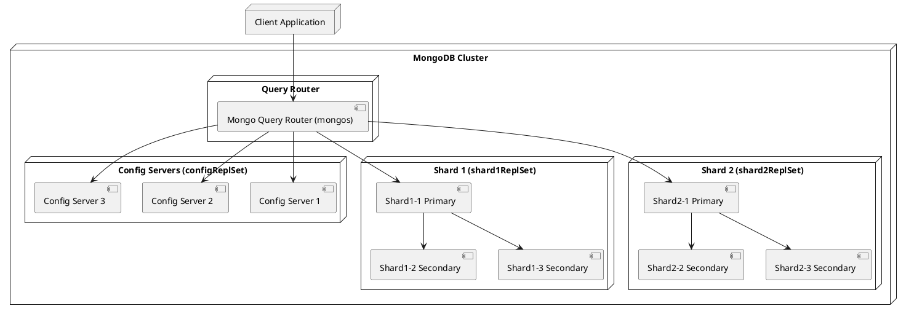

# Administration

## Réplicaction

Un Replica Set dans MongoDB est un groupe d'instances MongoDB qui maintiennent les mêmes données pour assurer la haute disponibilité et la redondance. Il est composé de plusieurs nœuds (serveurs), dont au moins un est un nœud primaire et les autres sont des nœuds secondaires.

### Composition d'un replica set

1. Un nœud primaire (Primary)

   - C'est le serveur principal qui reçoit toutes les opérations d'écriture et de lecture (sauf si la lecture secondaire est activée).
   - Il synchronise automatiquement ses données avec les nœuds secondaires.
   - Un seul nœud primaire peut exister à un instant donné.

2. Un ou plusieurs nœuds secondaires (Secondary)

    - Ces nœuds répliquent les données du nœud primaire en lisant son oplog (journal des opérations).
   - Ils servent principalement pour la redondance et la tolérance aux pannes.
   - Ils peuvent être configurés pour répondre aux requêtes en lecture si besoin.
      
3. (Optionnel) Un nœud arbitre (Arbiter)

   - Il ne stocke pas de données mais participe au processus d'élection en cas de panne du nœud primaire.
   - Il est utile pour éviter une configuration avec un nombre pair de nœuds, ce qui permet d'éviter des conflits lors des élections.

### Fonctionnement d'un Replica Set

1. Lorsqu'une requête d'écriture arrive, elle est traitée par le nœud primaire.
2. Les nœuds secondaires répliquent les modifications en copiant l'oplog du primaire. La réplication est asynchrone, mais généralement assez rapide.
3. Si le nœud primaire tombe en panne, un vote d'élection est déclenché entre les secondaires et un nouveau nœud primaire est élu automatiquement.
4. Une fois le nœud défaillant réparé, il peut réintégrer le Replica Set en tant que nœud secondaire.

### Un exemple avec Docker

```yaml
# docker-compose.yml

services:
  mongo1:
    image: mongo:latest
    container_name: mongo1
    restart: always
    command: ["mongod", "--replSet", "rs0", "--bind_ip", "0.0.0.0"]
    ports:
      - "27020:27017"
    networks:
      - mongo-network
    volumes:
      - mongo1_data:/data/db

  mongo2:
    image: mongo:latest
    container_name: mongo2
    restart: always
    command: ["mongod", "--replSet", "rs0", "--bind_ip", "0.0.0.0"]
    ports:
      - "27021:27017"
    networks:
      - mongo-network
    volumes:
      - mongo2_data:/data/db

  mongo3:
    image: mongo:latest
    container_name: mongo3
    restart: always
    command: ["mongod", "--replSet", "rs0", "--bind_ip", "0.0.0.0"]
    ports:
      - "27022:27017"
    networks:
      - mongo-network
    volumes:
      - mongo3_data:/data/db

  mongo-arbiter:
    image: mongo:latest
    container_name: mongo-arbiter
    restart: always
    command: ["mongod", "--replSet", "rs0", "--bind_ip", "0.0.0.0"]
    networks:
      - mongo-network

  setup:
    image: mongo:latest
    container_name: mongo-setup
    depends_on:
      - mongo1
      - mongo2
      - mongo3
      - mongo-arbiter
    entrypoint: [ "bash", "-c", "sleep 10 && mongosh --host mongo1:27017 /scripts/replica-init.js" ]
    volumes:
      - ./scripts:/scripts
    networks:
      - mongo-network

networks:
  mongo-network:
    driver: bridge
volumes:
  mongo1_data:
  mongo2_data:
  mongo3_data:
```

**Nous avons ici 4 conteneurs**
- Trois conteneurs de données dont le premier sera le nœud primaire.
- Un conteneur d'arbitrage qui ne servira qu'à voter pour un nouveau nœud primaire.
- Un conteneur `setup` qui lancera la configuration après un délai pour laisser le temps aux autres conteneurs de s'instancier.

#### Comment ça marche

#### Configuration des nœuds

```yaml
command: ["mongod", "--replSet", "rs0", "--bind_ip", "0.0.0.0"]
```

Chaque conteneur lance le service MongDB avec les options suivantes :

- `--replSet` indique que ce conteneur fait partie d'un replica set.
- `rs0`, il s'agit de l'identifiant du replica set.
- `"--bind_ip", "0.0.0.0"`, lie le conteneur à toute interface réseau disponible. Cela permet aux conteneurs de communiquer entre eux.

#### Initialisation

Le conteneur `setup` déclare un entrypoint avec la commande suivante :

```yaml
entrypoint: [ "bash", "-c", "sleep 10 && mongosh --host mongo1:27017 /scripts/replica-init.js" ]
```

- `bash`, le programme à lancer
- `-c`, indique que la chaine de caractère qui va suivre doit être exécutée comme une instruction. S'il y a plusieurs commandes dans cette chaîne elles doivent être séparées par `&&`.
- `sleep 10`, définit un délai avant l'exécution des commandes suivantes.
- `mongosh --host mongo1:27017 /scripts/replica-init.js`, lance un shell MongoDB sur le premier nœud et exécute un fichier javascript de configuration.

```javascript
rs.initiate({
    _id: "rs0",
    members: [
        { _id: 0, host: "mongo1:27017" },
        { _id: 1, host: "mongo2:27017" },
        { _id: 2, host: "mongo3:27017" },
        { _id: 3, host: "mongo-arbiter:27017", arbiterOnly: true }
    ]
});
```

### Test

<procedure>
<step>
Instancier toute la stack

```shell
docker compose up -d
```
</step>

<step>
Lancer un terminal sur le nœud primaire

```shell
docker exec -it mongo1
```
</step>
<step>
Vérifier la configuration du replica set

```mongodb
rs.status()
```
</step>
<step>
Effectuer une insertions

```mongodb
use test
```

```mongodb
db.persons.insertOne({name: 'Ada Lovelace'}
```
</step>

<step>
Sortir du shell Mongo

```mongodb
exit
```
</step>
<step>
En ouvrir un autre sur le conteneur mongo2

```shell
docker exec -it mongo2
```
</step>
<step>
Vérifier que l'insertion a bien été répliquée

```mongodb
use test
```

```mongodb
db.persons.find({})
```
</step>
</procedure>

### Avantages de cette technique

- **Haute disponibilité** : Si un serveur tombe, un autre prend le relais.
- **Protection contre la perte de données** : La réplication garantit la redondance.
- **Scalabilité en lecture** : On peut lire depuis les secondaires pour alléger la charge.

## Sharding

Technique de partitionnement horizontal des données, permettant de distribuer la charge entre plusieurs serveurs afin d'améliorer les performances et la scalabilité d'une base de données volumineuse.

### Pourquoi
- **Scalabilité horizontale** : Permet d'ajouter des nœuds pour répartir la charge.
- **Gestion efficace des grosses bases de données** : Divise les collections en morceaux (chunks) répartis sur plusieurs shards.
- **Disponibilité et tolérance aux pannes** : Chaque shard peut être répliqué pour garantir la haute disponibilité.

### Comment

Un cluster "sharded" est composé des serveurs suivants :

- **Shards** : Stockent les données réelles et peuvent être des Replica Sets pour assurer la haute disponibilité.
- **Config Servers** : Stockent la configuration du cluster et les métadonnées des chunks.
- **Query Routers (mongos)** : Servent d'interface entre l'application et le cluster, dirigeant les requêtes vers les bons shards.



### Exemple de déploiement avec Docker

- 2 shards (répliqués)
- 3 config servers
- 1 routeur (mongos)

```yaml
version: '3.8'

services:
   # Config Servers (stockent la config du cluster)
   configsvr1:
      image: mongo:6.0
      container_name: configsvr1
      command: mongod --configsvr --replSet configReplSet --port 27017
      ports:
         - 27017:27017
      networks:
         - mongo-cluster

   configsvr2:
      image: mongo:6.0
      container_name: configsvr2
      command: mongod --configsvr --replSet configReplSet --port 27017
      networks:
         - mongo-cluster

   configsvr3:
      image: mongo:6.0
      container_name: configsvr3
      command: mongod --configsvr --replSet configReplSet --port 27017
      networks:
         - mongo-cluster

   # Shard 1 - Replica Set
   shard1-1:
      image: mongo:6.0
      container_name: shard1-1
      command: mongod --shardsvr --replSet shard1ReplSet --port 27017
      networks:
         - mongo-cluster

   shard1-2:
      image: mongo:6.0
      container_name: shard1-2
      command: mongod --shardsvr --replSet shard1ReplSet --port 27017
      networks:
         - mongo-cluster

   shard1-3:
      image: mongo:6.0
      container_name: shard1-3
      command: mongod --shardsvr --replSet shard1ReplSet --port 27017
      networks:
         - mongo-cluster

   # Shard 2 - Replica Set
   shard2-1:
      image: mongo:6.0
      container_name: shard2-1
      command: mongod --shardsvr --replSet shard2ReplSet --port 27017
      networks:
         - mongo-cluster

   shard2-2:
      image: mongo:6.0
      container_name: shard2-2
      command: mongod --shardsvr --replSet shard2ReplSet --port 27017
      networks:
         - mongo-cluster

   shard2-3:
      image: mongo:6.0
      container_name: shard2-3
      command: mongod --shardsvr --replSet shard2ReplSet --port 27017
      networks:
         - mongo-cluster

   # Query Router (mongos)
   mongos:
      image: mongo:6.0
      container_name: mongos
      command: mongos --configdb configReplSet/configsvr1:27017,configsvr2:27017,configsvr3:27017 --port 27017
      ports:
         - 27020:27017
      networks:
         - mongo-cluster
      depends_on:
         - configsvr1
         - configsvr2
         - configsvr3
         - shard1-1
         - shard1-2
         - shard1-3
         - shard2-1
         - shard2-2
         - shard2-3

networks:
   mongo-cluster:
      driver: bridge

```

#### Configuration du cluster

Pour la configuration, nous créons un fichier bash

```bash
#!/bin/bash

## setup-sharding.sh

echo "⏳ Initialisation du cluster MongoDB shardé..."

# Initialiser le Replica Set des Config Servers
echo "🚀 Configuration des Config Servers..."
docker exec -it configsvr1 mongosh --eval '
rs.initiate({
  _id: "configReplSet",
  configsvr: true,
  members: [
    { _id: 0, host: "configsvr1:27017" },
    { _id: 1, host: "configsvr2:27017" },
    { _id: 2, host: "configsvr3:27017" }
  ]
});
'

# Attendre quelques secondes pour l'initialisation
sleep 5

# Initialiser le Replica Set du Shard 1
echo "🚀 Configuration du Shard 1..."
docker exec -it shard1-1 mongosh --eval '
rs.initiate({
  _id: "shard1ReplSet",
  members: [
    { _id: 0, host: "shard1-1:27017" },
    { _id: 1, host: "shard1-2:27017" },
    { _id: 2, host: "shard1-3:27017" }
  ]
});
'

# Attendre quelques secondes pour l'initialisation
sleep 5

# Initialiser le Replica Set du Shard 2
echo "🚀 Configuration du Shard 2..."
docker exec -it shard2-1 mongosh --eval '
rs.initiate({
  _id: "shard2ReplSet",
  members: [
    { _id: 0, host: "shard2-1:27017" },
    { _id: 1, host: "shard2-2:27017" },
    { _id: 2, host: "shard2-3:27017" }
  ]
});
'

# Attendre quelques secondes pour l'initialisation
sleep 5

# Ajouter les Shards au Query Router (mongos)
echo "🔗 Ajout des shards au routeur..."
docker exec -it mongos mongosh --eval '
sh.addShard("shard1ReplSet/shard1-1:27017");
sh.addShard("shard2ReplSet/shard2-1:27017");
'

# Activer le sharding sur la base de données `mydatabase`
echo "✅ Activation du sharding sur la base de données mydatabase..."
docker exec -it mongos mongosh --eval '
sh.enableSharding("mydatabase");
'

# Vérifier l'état du cluster
echo "📜 État du cluster :"
docker exec -it mongos mongosh --eval 'sh.status();'

echo "🎉 Cluster MongoDB sharded configuré avec succès !"

```

Pour rendre le fichier exécutable

```shell
chmod +x setup-sharding.sh
```

Pour lancer le script

```shell
./setup-sharding.sh
```

#### Pourquoi trois config servers ?

Un Config Server dans MongoDB stocke les métadonnées du sharding (comme la répartition des chunks entre les shards). Il est essentiel au bon fonctionnement du cluster.

MongoDB exige au moins trois Config Servers pour garantir :

- **La haute disponibilité :**

Si un seul Config Server tombe en panne, le cluster continue à fonctionner.
Avec un seul Config Server, une panne entraînerait une perte de données de sharding.


- **La tolérance aux pannes :**

MongoDB utilise un Replica Set pour les Config Servers.
Avec 3 membres, même si un serveur tombe, les deux autres peuvent continuer à fonctionner.

- **La sécurité des métadonnées :**

Le sharding repose sur ces métadonnées. Si elles sont corrompues ou perdues, le cluster devient instable.

Trois Config Servers assurent une réplication et une cohérence des informations.

- **Éviter les partitions réseau :**

Si un seul Config Server est utilisé et qu’il devient injoignable, le mongos (Query Router) ne peut plus router les requêtes.

Avec trois Config Servers, un quorum est toujours maintenu.

#### Règles importantes pour les Config Servers
- Toujours avoir un nombre impair de Config Servers (ex : 3, 5, 7...) pour éviter les conflits de quorum.
- Ne pas stocker des données utilisateur sur les Config Servers (ils sont uniquement destinés aux métadonnées).
- Tous les Config Servers doivent être en Replica Set (obligatoire depuis MongoDB 3.4).


